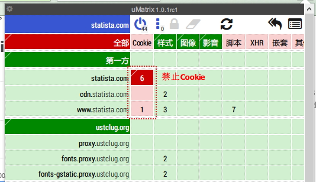
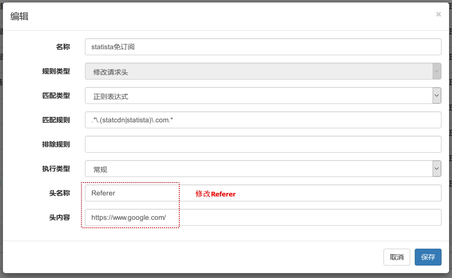

免除一些网站的订阅限制

##### HBR: 默认3篇文章限制, 不知是每天还是每周

解决办法: 禁用cookie (使用umatrix)

##### Economist: 默认每周2篇文章限制

解决办法: 将Referer改为https://www.google.com/

##### SWJ: 有锁形标识的文章需订阅

解决办法: 将Referer改为https://www.facebook.com/

##### FT: 需订阅

解决办法: 将Referer改为https://www.google.com/

##### Statista: 带+号的文章需要订阅, 年费还不便宜

解决办法:

- 禁止cookie (使用umatrix)

    
    
- 将Referer改为https://www.google.com/

    