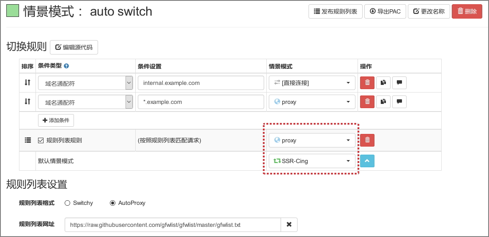
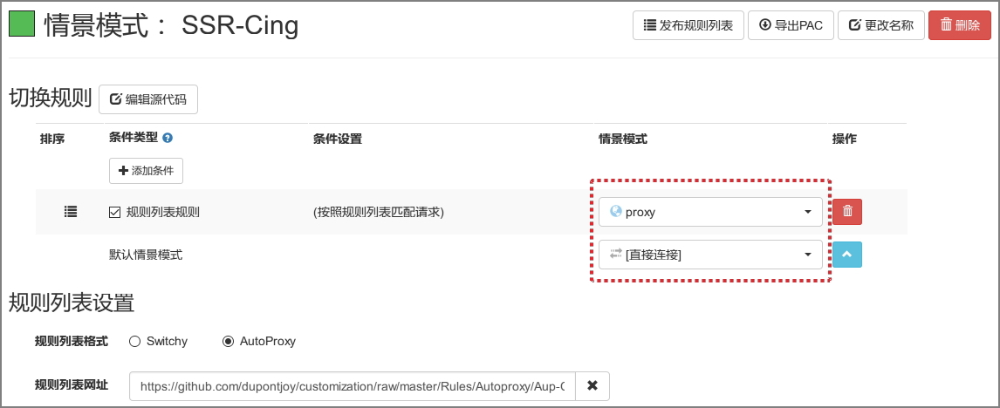
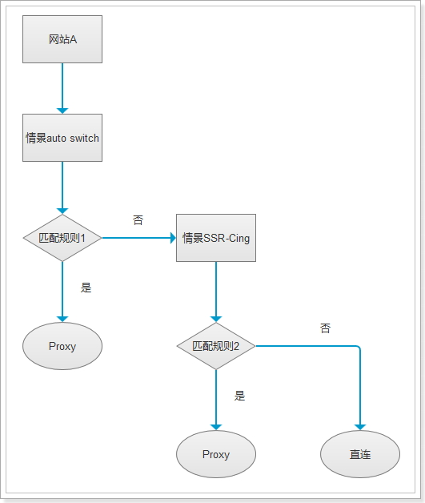

#### 设置备份

扩展: https://addons.mozilla.org/zh-CN/firefox/addon/switchyomega/

#### 多情景模式设置

##### 1. 主情景模式: auto switch

匹配第一个订阅规则时走Proxy, 否则走SSR-Cing

##### 2. 副情景模式: SSR-Cing

不匹配第一个订阅规则时:

- 匹配第二个订阅规则时走Proxy, 否则直连

#### 多情景模式流程

###個人維護的一些規則

by Cing

| | |
| :--- | :--- |
| **gfw-Cing-List.txt** | 自定义的翻墙网站列表 |
| **gfwlist.txt** | [官方][3], [官方规則][1]搬运 |
| **gfw.bricks** | [sites blocked by GFW][2]搬运 |
| **XX-Mini** | [on gayhub][6] |

  [1]: https://raw.githubusercontent.com/gfwlist/gfwlist/master/gfwlist.txt
  [2]: https://github.com/Leask/BRICKS/blob/master/gfw.bricks
  [3]: https://github.com/gfwlist/gfwlist
  [4]: https://us-somesky.rhcloud.com/gfw/lantern-japan-server.html
  [5]: https://github.com/dupontjoy/customization/raw/master/Rules/Autoproxy/Aup-Cing-List.txt
  [6]: https://github.com/xyuanmu/XX-Mini