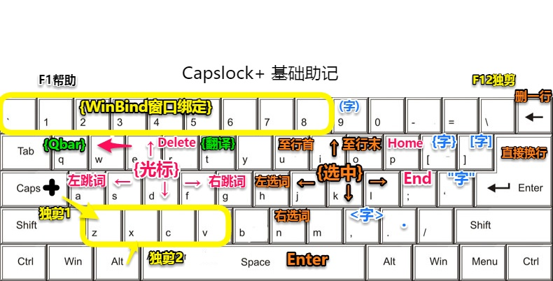

3.x：https://capslox.com/capslock-plus/

### Capslock+常用快捷键

| | |
| :--- | :--- |
| <kbd>Capslock</kbd> +  | 功能 |
| <kbd>E</kbd> <kbd>D</kbd> <kbd>S</kbd> <kbd>F</kbd> | 上/下/左/右 |
| <kbd>A</kbd> <kbd>G</kbd> | 向左/右按单词移动 |
| <kbd>P</kbd> <kbd>;</kbd> | 移动大至行首/行尾 |
| <kbd>I</kbd> <kbd>K</kbd> <kbd>J</kbd> <kbd>L</kbd> | 上/下/左/右选中文字 |
| <kbd>H</kbd> <kbd>.</kbd> | 向左/右选中单词 |
| <kbd>W</kbd> <kbd>R</kbd> | 向后/向前删除 |
| <kbd>[</kbd> <kbd>/</kbd> | 删除至行首/行尾 |
| <kbd>Backspace</kbd> | 删除当前行 |
| <kbd>Enter</kbd> | 直接换行，向下插一行 |
| | |
| <kbd>F1</kbd> | 打开说明文档 |
| <kbd>F2</kbd> | 单出计算板窗口 |
| <kbd>F4</kbd> | 短按，将当前窗口变为半透明/不透明 |
| <kbd>F5</kbd> | 重载程序 |
| <kbd>F6</kbd> | 置顶/解除置顶一个窗口 |