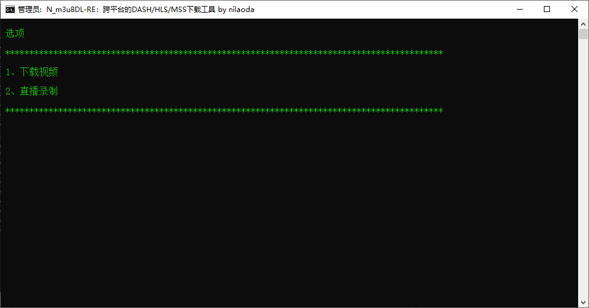
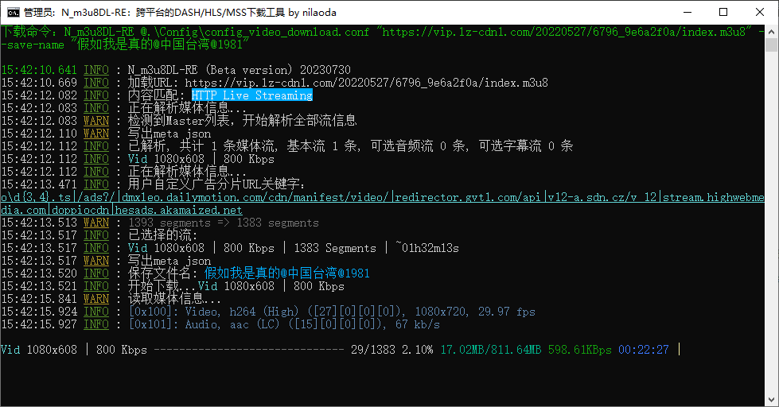

# N_m3u8DL-RE-Bat-Generator
批处理方式调用 N_m3u8DL-RE 下载m3u8视频和直播录制

## 说明：

设置了个人常用参数。其余参数自行到 config_*.conf 文件里添加。

需要自行配置ffmpeg.exe，到config_dir.conf里修改路径。

外置配置方法：https://github.com/nilaoda/N_m3u8DL-RE/issues/183

所有文件放到同一个文件夹下。

## 主程序
[N_m3u8DL-RE nilaoda](https://github.com/nilaoda/N_m3u8DL-RE)

## 运行截图

## 广告過滤

很多广告分片url与正常片段长度不同，通過这个特征来检测是否是广告。由于广告片段的id有可能无规律无法用一个正则匹配，所以全部分片都检测一遍，将所有url与正常片段长度不同的分片列出来。

此方法對于正常分片长度统一的有效。對于正常分片长度不统一的无效。所以生成的广告正则，需用户确认是否应用。

## ffmpeg

ffmpeg下载:
 - https://github.com/BtbN/FFmpeg-Builds/releases
 - https://github.com/shinchiro/mpv-winbuild-cmake
 - https://github.com/zhongfly/mpv-winbuild
