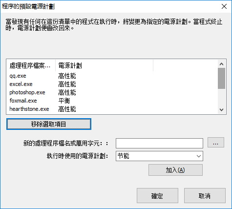

### Processlasso程式個人設置

Customized Processlasso settings

常用到的功能：

- [x] 程序黑名單 
- [x] 程序監控（按CPU或內存）
- [x] 程序电源計劃

| | |
| :-- | :-- |
| 程序界面: | 程序黑名單: |
|  |  |
| 程序監控: | 程序电源計劃: |
|  |  |

Processlasso程序下載及購買: https://bitsum.com/processlasso/

#### 设置要点

- 安装后不用额外设置也是可以的
- ProBalance自动调节CPU的响应性
- 只对最常用到的软件进行设置
- 不要过度设置

