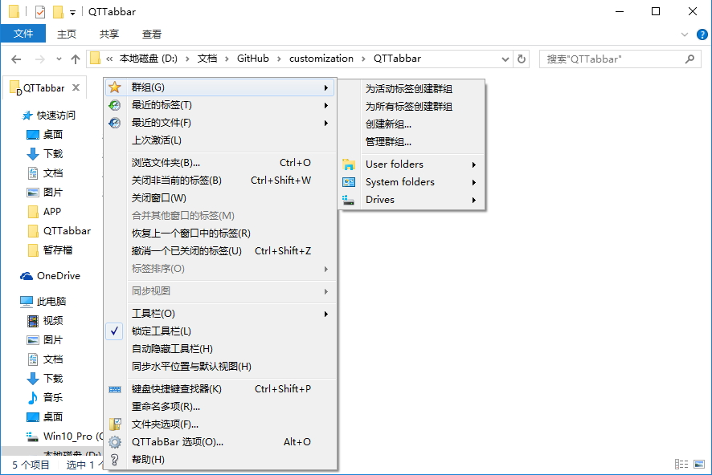
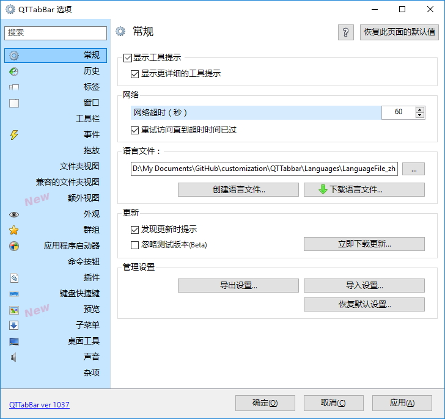
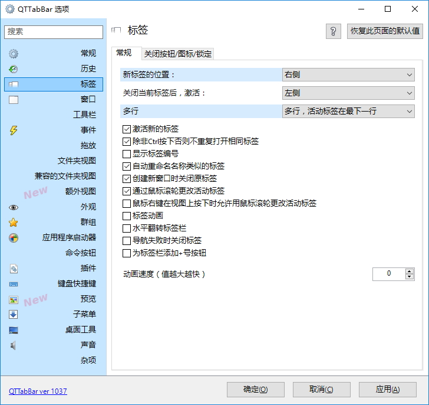
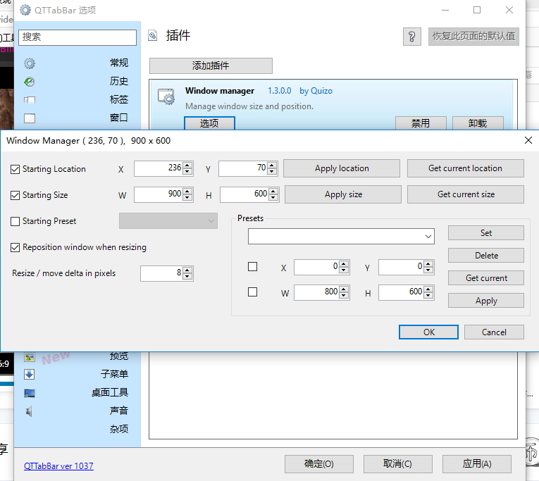

### QTTabBar

| | |
| :--- | :--- |
| APP | [QT主程序](http://qttabbar.wikidot.com/), [Clover](http://cn.ejie.me/)|
| | [插件Window Manager](http://qttabbar.wdfiles.com/local--files/plugins/WindowManager.zip)：设置窗口打开位置，及窗口大小 |
| Languages | [官方](http://qttabbar.wikidot.com/userpages:language-files) |
| | 個人维护的中文简体语言文件 |
| Settings| 个人设置 |

#### QTTabBar中文简体语言

在YFdyh000兄20150719版基础上增加，完整翻译1036版界面

- 2015.12.07 补全菜单，并修正一些表达

#### 軟件截圖

| | |
| :-- | :-- |
| |  |
| |  |
