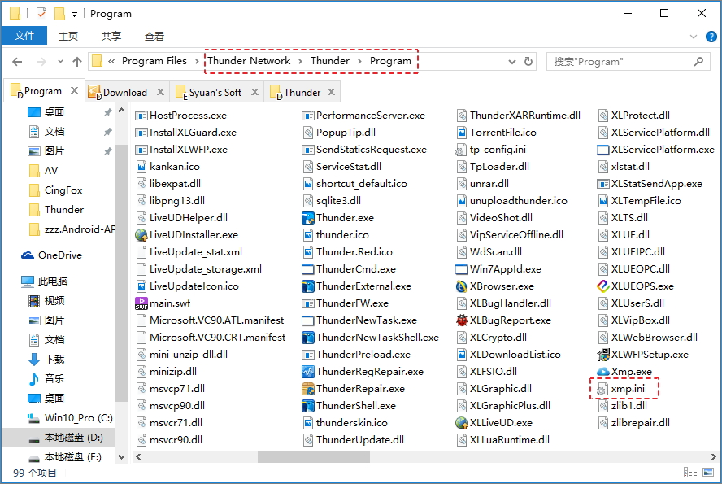
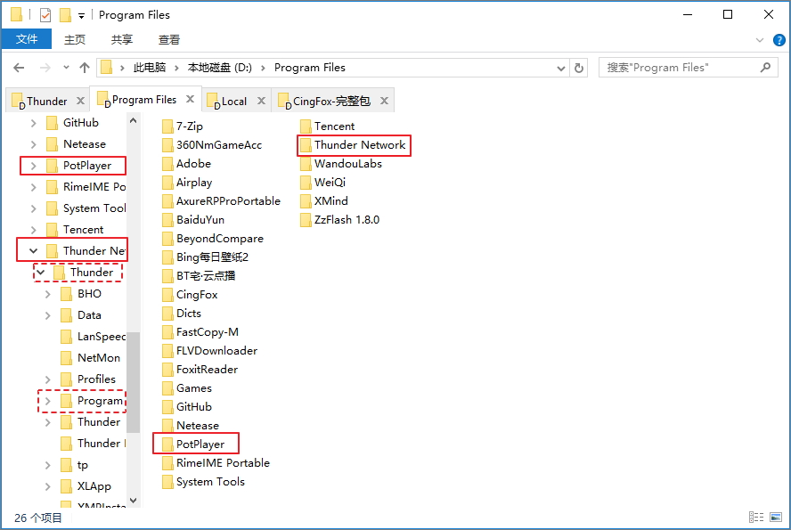

## 迅雷调用Potplayer边下边播

http://www.runningcheese.com/cindzzic-xunlei

#### 方法:

- A 安装[迅雷极速版](http://vip.xunlei.com/fast_xl/)（好像非极速版也可以）。
- B 在迅雷快捷方式上右击-->打开文件位置。
- C 新建一个.txt文件写入以下代码后改名为xmp.ini文件.

#### xmp.ini位置:

#### 注意:

每次更新都会覆盖掉xmp,ini，将会失效。因此最好是将文件保存在电脑内，更新之后将文件放置到上述文件夹内便可。

#### 代码1:

    [global]
    Path=E:\电脑软件\PotPlayer\PotPlayerMini.exe
          
#### 代码2:
    [global]
    Path=..\..\..\PotPlayer\PotPlayerMini.exe

Thunder文件夹与Potplayer文件夹位置关系:

